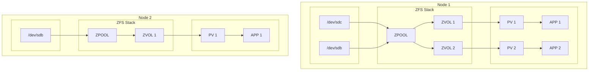

## OpenEBS - LocalPV-ZFS CSI Driver

## Overview

### What is OpenEBS ZFS LocalPV?
OpenEBS ZFS LocalPV is a [CSI](https://github.com/container-storage-interface/spec) plugin for implementation of [ZFS](https://en.wikipedia.org/wiki/ZFS) backed persistent volumes for Kubernetes. It is a local storage solution, which means the device, volume and the application are on the same host. It doesn't contain any dataplane, i.e only its simply a control-plane for the kernel zfs volumes. It mainly comprises of two components which are implemented in accordance to the CSI Specs:

1. CSI Controller - Frontends the incoming requests and initiates the operation.
2. CSI Node Plugin - Serves the requests by performing the operations and making the volume available for the initiator.

### Why OpenEBS ZFS LocalPV?
1. Light weight, easy to setup storage provisoner for provisioning node local volumes in k8s ecosystem.
2. Makes ZFS stack available to k8s, allowing end users to use the ZFS functionalites like snapshot, restore, clone, thin provisioning, resize, encryption, compression, dedup, etc for their Persistent Volumes.
3. Cloud native, i.e based on CSI spec, so certified to run on K8s.

### Architecture

LocalPV refers to storage that is directly attached to a specific node in the Kubernetes cluster. It uses locally available disks (e.g., SSDs, HDDs) on the node.

<b>Use Case</b>: Ideal for workloads that require low-latency access to storage or when data locality is critical (e.g., databases, caching systems).

#### Characteristics:
- <b>Node-bound</b>: The volume is tied to the node where the disk is physically located.
- <b>No replication</b>: Data is not replicated across nodes, so if the node fails, the data may become inaccessible.
- <b>High performance</b>: Since the storage is local, it typically offers lower latency compared to network-attached storage.

### Supported System

> | Name | Version |
> | :--- | :--- |
> | K8S | 1.23+ |
> | Distro | Alpine, Arch, CentOS, Debian, Fedora, NixOS, SUSE, RHEL, Ubuntu |
> | Kenel | oldest supported kernel is 2.6.32 |
> | ZFS | 0.7, 0.8, 2.2.3 |
> | Memory | ECC Memory is highly recommended |
> | RAM | 8GiB for best perf with Dedup enabled. (Will work with 2GiB or less without Dedup) |

Check the [features](./docs/features.md) supported for each k8s version.

### Documents

- [Prerequisites](./docs/quickstart.md#prerequisites)
- [Quickstart](./docs/quickstart.md#setup)
- [Developer Setup](./docs/developer-setup.md#development-workflow)
- [Testing](./docs/developer-setup.md#testing)
- [Contibuting Guidelines](./CONTRIBUTING.md)
- [Governance](./GOVERNANCE.md)
- [Changelog](./CHANGELOG.md)
- [Release Process](./RELEASE.md)

## Features

- [x] Access Modes
    - [x] ReadWriteOnce
    - ~~ReadOnlyMany~~
    - ~~ReadWriteMany~~
- [x] Volume modes
    - [x] `Filesystem` mode
    - [x] `Block` mode
- [x] Supports fsTypes: `ext4`, `btrfs`, `xfs`, `zfs`
- [x] Volume metrics
- [x] [Snapshot]
    - [x] [Create](docs/snapshot.md)
    - [x] [Restore](docs/clone.md#create-clone-from-snapshot)
- [x] [Clone](docs/clone.md#create-clone-from-volume)
- [x] [Volume Resize](docs/resize.md)
- [x] [Raw Block Volume](docs/raw-block-volume.md)
- [x] [Backup/Restore](docs/backup-restore.md)
- [ ] Ephemeral inline volume

## Dev Activity dashboard

## License compliance

